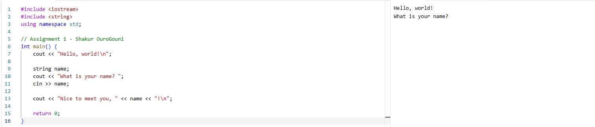

# CSCI-271-Fall-2026

This is my practice repository for CSCI-271 for the Fall 2026 semester.

### Student Information
* **Name:** Shakur OuroGouni
* **Course:** CSCI-271 (Fall 2026)

### Assignment 1: Personalized Hello World
* **Files Included:** `hello.cpp`
* **Description:** A C++ program that prompts the user for their name and outputs a personalized greeting.
* **How to Compile:** `g++ -o hello hello.cpp`
* **How to Run:** `./hello`

### Execution Screenshots
**Initial Prompt & Input:**

**Final Execution Output:**
.png)
